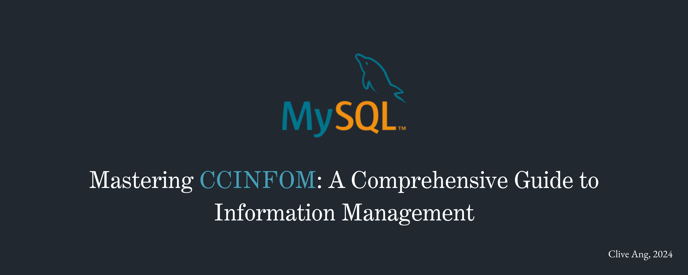
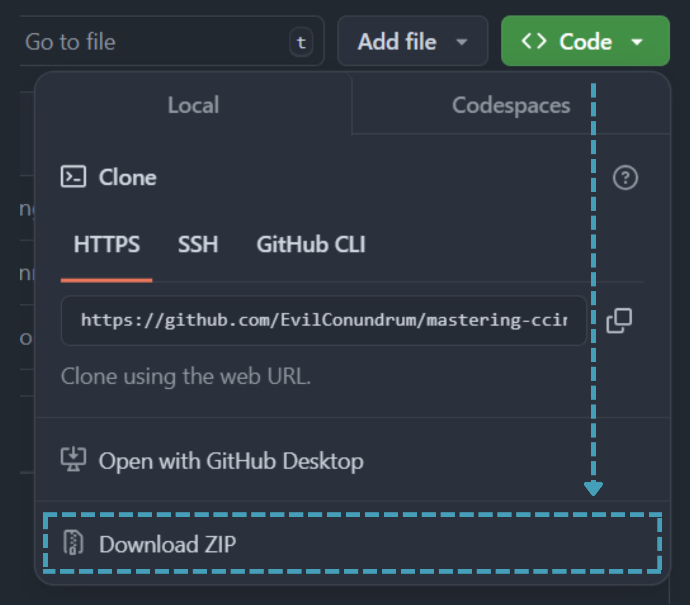

<p align="center">
  
  
  
  
</p>

## Table of Contents
- [Getting Started](#getting-started)
- [Course Content](#course-content)
- [Further Reading](#further-reading)
- [Contact](#contact)
## Getting Started

### Download with Git:

1. Clone the repository:
    ```bash
    git clone https://github.com/EvilConundrum/mastering-ccinfom.git
    ```

2. Navigate to the repository directory:
    ```bash
    cd mastering-ccinfom
    ```

3. Open the `curriculum` directory to access the content.

### Download Without Git:

1. Go to the top of this page and click the green Code button.

2. In the sub-menu, click "Download ZIP" as seen below:



3. Unzip the files.

4. Have fun (?) with the materials!

## Course Content
```
mastering-ccinfom/
├── curriculum/
│   ├── Database Design and Modeling/
│   │   └── ...
│   └── Writing SQL Queries/
│   │   └── ...
├── resources/
│   ├── fonts/
│   └── images/
└── README.md
```
### Key Topics Covered

#### Writing SQL Statements
- **Filters and Aggregates**: Learn how to use `WHERE`, `GROUP BY`, `HAVING`, and aggregate functions like `SUM`, `AVG`, and `COUNT` to filter and summarize data.
- **Joins**: Understand how to combine data from multiple tables using `INNER JOIN`, `LEFT JOIN`, and `RIGHT JOIN`.
- **Subqueries**: Explore nested queries and their applications in filtering, aggregation, and creating complex queries.

#### Database Design and Modeling
- **Database Design**: Guidelines and principles for structuring databases to meet specific requirements.
- **Data Models**: Overview of conceptual, logical, and physical data models used in database systems.
- **Relations**: Explanation of relationships between tables, including one-to-one, one-to-many, and many-to-many.
- **Database Design Techniques**: Methods to create efficient, scalable, and maintainable database designs.
- **Database Normalization**: Steps to organize data into tables, reduce redundancy, and maintain integrity through normalization forms (1NF, 2NF, and 3NF).

### Problem Sets and Reviewers
- **DBHR Complete Set**: A comprehensive set of problem sets covering all major database concepts.
- **DBHR Curated20**: A curated selection of 20 challenging problems from the DBHR Complete Set for focused practice.
- **Clive's Case Studies 1 - 3**: Fictional scenarios requiring database design, optimization, and problem-solving.
- **Oli's Design Exercise**: A practical exercise to apply database design principles to a real-world use case.

## Further Reading

- [Book] [John L. Viescas - SQL Queries for Mere Mortals.pdf](https://github.com/user-attachments/files/17941816/John.L.Viescas.-.SQL.Queries.for.Mere.Mortals.pdf)
- [Tutorial] [SQLZoo](https://sqlzoo.net/wiki/SQL_Tutorial)
- [Tutorial] [W3Schools](https://www.w3schools.com/mysql/default.asp)
- [Interactive] [LeetCode](https://leetcode.com/problemset/database)

## Contact

For questions, mistakes, or feedback, feel free to reach out via:
- Email: [clive_jarel_c_ang@dlsu.edu.ph](mailto:clive_jarel_c_ang@dlsu.edu.ph)
- Discord: evilconundrum or EvilC#5174
- Github Issues: [Open an Issue](https://github.com/EvilConundrum/mastering-ccinfom/issues)
